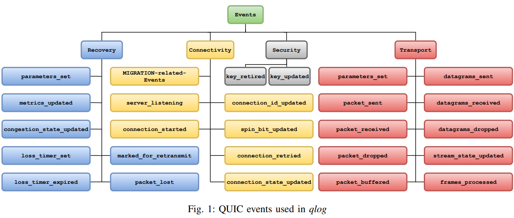
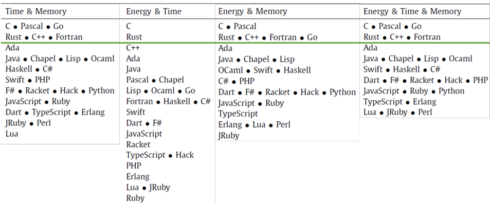
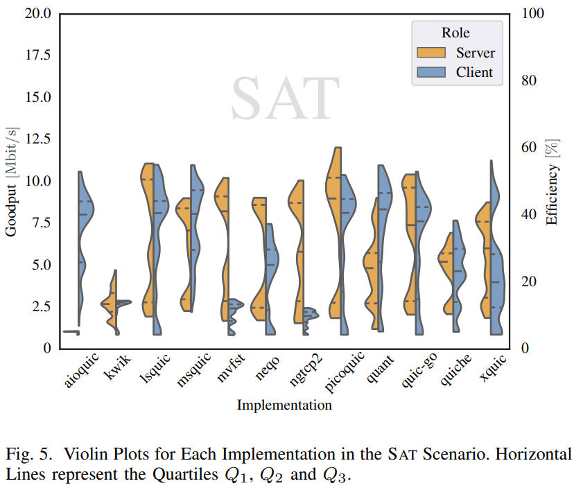
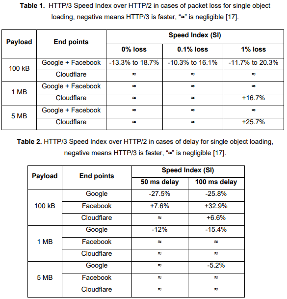
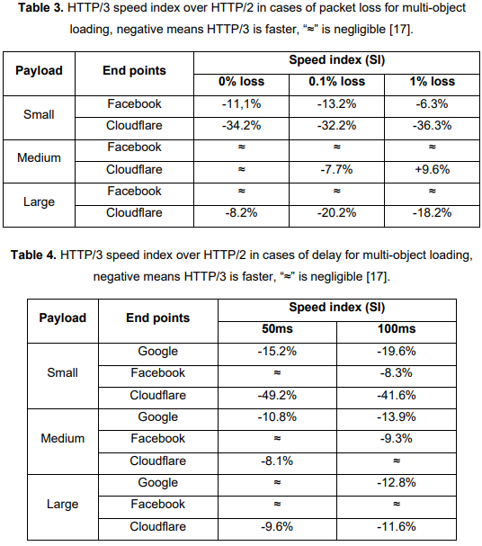
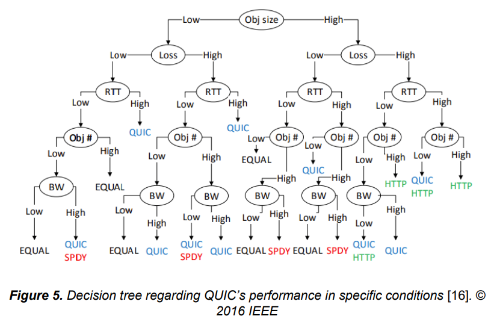
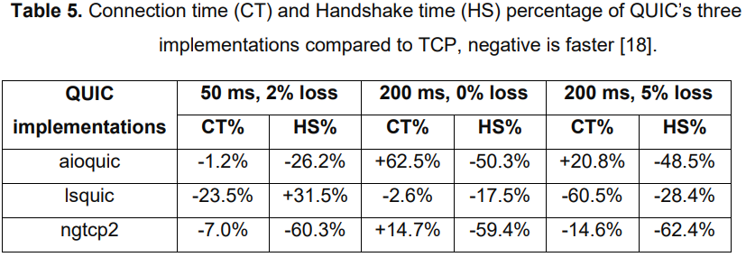

# QUIC implementációk teljesítménye és tervezése

Ez egy nagyon friss cikk (Date Added to IEEE Xplore: 17 March 2023), jó lenne valahogy hozzáférni:

[Performance Benchmarking of the QUIC Transport Protocol](https://ieeexplore.ieee.org/document/10060785)

## QUIC implementációk listája és tudnivalók saját implementációhoz

Alapoldal: [QUIC Working Group (quicwg.org)](https://quicwg.org/)

[1] két forrást említ amik nyilvántartják a jelenleg létező implemetációkat, a két forrás együtt kiegészítik egymást, ezek:

- A QUIC Working Group listája: [Implementations · quicwg/base-drafts Wiki (github.com)](https://github.com/quicwg/base-drafts/wiki/Implementations)
  - A lista mellett egyéb hasznos infók is vannak.
  - Nem rég frissítették (2023. ápr. 6.)
  - Saját implementációt hozzáadhatunk.
-  QUIC interoperability runner (QIR): [QUIC Interop Runner (seemann.io)](https://interop.seemann.io/)
  - A résztvevő implementációkhoz forrás linkeket is biztosít.
  - Automated, continuous interop testing
  - Saját implementációt hozzáadhatunk.
  - Implementers are encouraged to join this effort by making [compatible Docker images](https://github.com/marten-seemann/quic-interop-runner#building-a-quic-endpoint) of their implementations available.

Az előbb említett QIR-en kívül az interoperability-t itt is - talán más szempontból is - nyomon követhetjük: [IETF QUIC Interop Matrix - Google Táblázatok](https://docs.google.com/spreadsheets/d/1D0tW89vOoaScs3IY9RGC0UesWGAwE6xyLk0l4JtvTVg/edit#gid=2079541679)

Ha implementálni akarunk, akkor érdemes csatlakozni a [QUIC fejlesztői Slack csatornához](https://quicdev.slack.com/)

- contact the [WG chairs](mailto:quic-chairs@ietf.org) for an invitation
- Note that discussions on Slack are considered IETF contributions under “Note Well”.

QUIC dokumentumok: [QUIC (quic) (ietf.org)](https://datatracker.ietf.org/wg/quic/documents/) [4]

[7] jó összefoglalást ad a __QUIC Design choices__-ról, bővebben ezen szempontokról: Congestion control, Flow control, Multiple Streams, Packet size, Client Validation of 0-RTT

## __Eszközök  ehhez: QUIC implementáció analízise, debuggolása, vizualizációja__

- [Tools · quicwg/base-drafts Wiki (github.com)](https://github.com/quicwg/base-drafts/wiki/Tools)
- [1] ezeket használta: [Qlog](https://github.com/quicwg/qlog) ("Qlog is a standardized logging format for QUIC applications." [2]), [Powertop](https://github.com/fenrus75/powertop) (mint Power Monitoring eszköz), [NetData](https://github.com/netdata/netdata) (mint Resource Monitoring eszköz)
- [2] használta ezt is: tshark
- [3] használta ezt is: [MONROE - Measuring Mobile Broadband Networks in Europe (monroe-project.eu)](https://www.monroe-project.eu/)
- [4] az iperf -hez hasonlítja a QUIC teljesítményét, és ezt is használta: ns-3 Network Simulator, pyshark (python tshark)

(forrás: [3])

## QUIC implementáció választási kritériumok [1] szerint

- HTTP3 és a legfrissebb QUIC verzió támogatása
- Aktív repository-ja van az elmúlt 30 napban (tehát aktívan fejlesztik)
- Nagy-teljesítményű és energiatakarékos programozási nyelven implementálták

## QUIC implementációkról táblázat [1]

(ebben a repóban szintén megvan quic_implementation_table.csv és quic_implementation_table.xlsx fájlokban)

| Implemeation              | Language                  | Supported Version                       | H3   | QUIC V1 | Client H3 test no error |
| ------------------------- | ------------------------- | --------------------------------------- | ---- | ------- | ----------------------- |
| aioquic                   | Python                    | d-29 through v1                         | Yes  | Yes     |                         |
| Akamai QUIC               | No Information            | d-29                                    | Yes  |         |                         |
| AppleQUIC                 | C, Objective-C, and Swift | d-29 and v1                             |      | Yes     |                         |
| ATS                       | C++                       | d-29                                    |      |         |                         |
| Chromium                  | C, C++                    | Q043, Q046, Q050, T050, T051, d-27, 29. | Yes  |         |                         |
| F5                        | C                         | d-29 and 32                             |      |         |                         |
| Haskell quic              | Haskell                   | d-29                                    | Yes  |         |                         |
| Kwik (H.09) / Flupke (H3) | Java                      | d-29 through v1                         | Yes  | Yes     |                         |
| lsquic                    | C                         | Q043, Q046, Q050, d-27, 29, 34, and v1  | Yes  | Yes     | Yes                     |
| MsQuic                    | C                         | d-29 & v1                               |      | Yes     |                         |
| mvfst                     | C++                       | d-29                                    | Yes  | Yes     | Yes                     |
| Neqo                      | Rust                      | d-27 through v1                         | Yes  | Yes     |                         |
| ngtcp2                    | C                         | d-29, 30, 31, 32, and v1                |      | Yes     |                         |
| nghttp3                   | C                         | d-32                                    |      |         |                         |
| nginx                     | C                         | d-27 through 32                         |      |         |                         |
| nginx-cloudflare          | C                         | d-27, 28, 29                            |      |         |                         |
| picoquic                  | C                         | d-27, 28, 29, 30, 31, 32 and v1         | Yes  | Yes     | Yes                     |
| PQUIC                     | C (and eBPF)              | d-29                                    |      |         |                         |
| QUANT                     | C                         | d-33, 34, v1                            |      | Yes     |                         |
| quiche                    | Rust                      | d-27, 28, 29 and v1                     | Yes  | Yes     | Yes                     |
| quicly                    | C                         | d-27                                    |      |         |                         |
| Quinn                     | Rust                      | d-28                                    | Yes  | Yes     |                         |
| quic-go                   | Go                        | d-29                                    | Yes  | Yes     | Yes                     |
| s2n-quic                  | Rust                      | v1                                      | Yes  | Yes     |                         |
| XQUIC                     | C                         | v1 and d-29                             | Yes  | Yes     |                         |
| Node.js QUIC              | C++ and JavaScript        | d-25                                    | Yes  |         |                         |
| proxygen                  | C++                       | d-23                                    | Yes  |         |                         |

## Programozási nyelvek hatékonysági rangsorolása

"Considering the goal to analyze QUIC performance and its green aspect, we looked at Pereira et al. research of available programming languages and ranked them in energy, time, and memory. The top-rank programming languages that are energy efficient are C, Pascal, Go, Rust, C++, and Fortran, while C and Rust lead in the global results for energy and time" [1] [Pereira et al., "Ranking Programming Languages by Energy Efficiency"]:

## Inkább Docker mint telepítés

Egyes implementációk biztosítanak Dockerfile-t vagy docker image-t, ha van, akkor inkább ezt érdemes használni, mint natívan telepíteni.

## QUIC implementáció tesztek kiértékelési teljesítmény metrikái

[1] szerint:

- Csomag veszteség
- RTT
- Troughput
- Energia fogyasztás
- CPU kihasználtság
- Memória használat

## QUIC implementációkat vizsgáló cikkek eredményei

### Picoquic vs Quiche [1] (2022.09.29.)

"Picoquic performs better than Quiche, specifically in terms of throughput, resource utilization efficiency, and energy consumption on finishing the task."

"Finally, we can conclude that Picoquic implementation is both reliable and environmentally friendly compared to Quiche."

### aioquic vs lsquic vs ngtcp2 [2] (2021.04.26.)

"the results of the tests show that all of the QUIC implementations are able to match, or even beat TCP connection times in certain scenarios. They are also all able to deliver shorter handshakes than TCP, excluding some anomalies, in most scenarios. One out of the three tested QUIC implementations, LSQUIC, actually delivers faster connection times to TCP in all but the ideal connection scenario, and performs very consistently overall. LSQUIC does feature the longest handshake out of the three QUIC implementations tested, however, even slightly exceeding that of TCP in a select few test cases. The results for ngtcp2 include a bit more variance, with slightly improved performance compared to TCP in some scenarios, and slightly worse in others. A significant improvement in handshake duration stays constant throughout, however. Finally, aioquic performs quite well with lower delays and short connections, even surpassing its counterparts in some scenarios, but overall falls short with longer connections and higher delays. While it does generally deliver a shorter handshake than TCP, comparable to ngtcp2, anomalies were present in some connections, affecting the averages negatively."

"In terms of packets, all QUIC implementations send a higher amount of packets than TCP. One reason for this is smaller payload sizes compared to TCP, as minimum datagram sizes are used since the test network does not feature any unit discovery protocols. LSQUIC and ngtcp2 generally send similar packet amounts, and exhibit similar client-server packet ratios, whereas aioquic sends significantly more packets in the form of acknowledgements. Server overhead for all QUIC implementations 66 is higher than it is for TCP. Running the QUIC implementations in parallel with TCP shows, that LSQUIC uses network resources significantly more aggressively than TCP, whereas aioquic and ngtcp2 let TCP take priority"

### [3] konklúziói (2021)

"we have observed that QUIC is advantageous over TCP for what concerns HTTP applications."

"In addition, the congestion control algorithm, especially under mobility, strongly impacts the QUIC’s overall performance"

### [4] eredményei (2022.02.19.)

"GOODPUT uses an emulated low-latency channel with a data rate of 10 Mbit/s to measure the average goodput for the transfer of a large file"

### [5] konklúziói (2022.03.04.)

"While QUIC provides features such as built-in multiplexing and 0-RTT, we did not find  that it offers a substantial performance advantage over TCP for empirical tests with either single  object transmissions or multi-object transmissions."

"Based on the data we collected, network-level  protocols have little to no impact on throughput or user experience when compared to congestion  control algorithms, even over links with high round-trip times."

"Even when using production servers, QUIC offers little to no benefit  for multiplexed multi-object transmissions used in HTTP3 and can cause worse performance on  certain Lighthouse metrics."

"Based on the higher variance in single-object transmissions using  NGTCP2, it is possible that open-source QUIC implementations and the congestion control  implementations that they use are not as optimized as to kernel based TCP solutions at this time,  potentially explaining the inferior performance."

### [6] eredményei (2022.06)

#### Konklúziók

"It can be inferred  that QUIC is best suited to be used in mobile environment, where bandwidth is usually limited, and connections are inconsistent."

"When it comes to performance, QUIC does excel over TCP in these non-ideal scenarios.  However, none of the analyses showed significant benefits from QUIC in lossless, low  delay and high bandwidth connections. This means there may not be real incentive for  using QUIC, for example, in fiber connections, as well as in the upcoming 5G wireless  mobile network standard, where bandwidth is comparable with fiber connections."

"Most of the references’ results used relatively outdated version of QUIC, mostly carried  out while using HTTP/2 for the application layer, and in controlled environments. This  means that the results might not reflect accurately how QUIC would perform on realworld internet, and how it would be using the HTTP/3 which is specifically optimized  around QUIC. Further research and analyses using more up-to-date versions of these  protocols are needed, as well as their usage and performance in the upcoming standard  of mobile wireless network."

### [7] összefoglalás (2022.07)

Jó összefoglalást ad a QUIC Design choices-ról, ezen szempontokról: Congestion control, Flow control, Multiple Streams, Packet size, Client Validation of 0-RTT

Mások QUIC teljesítmény mérő cikkéről ad összegzést.

"...A. Yu and T. A. Benson, where they compared the performance of different QUIC implementations with TCP over public available endpoints. We saw that in gerneral the QUIC implementations had the advantage when transmitting small resources due to the improved handshake design of the protocol. For larger files, the performance balances out because the impact of the handshake minimizes. However, we saw some discrepancies to this behavior. Most of these performance differences could be traced back to the developers design of the implementations or the configuration of the operators."

"We feel that future analysis is needed to compare the performance of the different implementations. It is espacially important to focus on which design choices impacts the performance of the protocol."

## Forrásjegyzék

- [1] 2022.09.29. [Performance Evaluation of Various QUIC Implementations](https://www.diva-portal.org/smash/get/diva2:1691838/FULLTEXT03)
  - Picoquic, Quiche
  - Ez nagyon jó
- [2] 2021.04.26. [Performance analysis of modern QUIC implementations](https://aaltodoc.aalto.fi/bitstream/handle/123456789/107677/master_Halme_Calle_2021.pdf?sequence=1&isAllowed=y)
  - aioquic, lsquic, ngtcp2 (ez is quic), tcp
- [3] 2021 [On the Experimental Assessment of QUIC and Congestion Control Schemes in Cellular Networks](https://dspace.networks.imdea.org/bitstream/handle/20.500.12761/973/MedNetCom2021.pdf)
  - flowsim vs Mvfst vs tcp
  - Qlog
  - MONROE platform
- [4] 2022.02.19. [Performance of QUIC Implementations Over Geostationary Satellite Links](https://arxiv.org/pdf/2202.08228.pdf)
  - aioquic, kwik, lsquic, msquic, mvfst, neqo, ngtcp2, picoquic, quant, quic-go, quiche, xquic
  - Vannak jó hivatkozásai
- [5] 2022.03.04. [Performance Analysis of QUIC versus TCP on Satellite Networks](https://digital.wpi.edu/downloads/9593tz440)
  - lsquic, kwik, ngtcp2, msquic
- [6] 2022.06 [LITERATURE REVIEW ON QUIC  PROTOCOL AND ITS PERFORMANCE](https://trepo.tuni.fi/bitstream/handle/10024/140865/NguyenHung.pdf?sequence=2)
  - aioquic, lsquic, ngtcp2
- [7] 2022.07 [Comparison of Different QUIC Implementations](https://www.net.in.tum.de/fileadmin/TUM/NET/NET-2022-07-1/NET-2022-07-1_10.pdf)
  - QUIC Design choices
  - QUIC vs TCP
